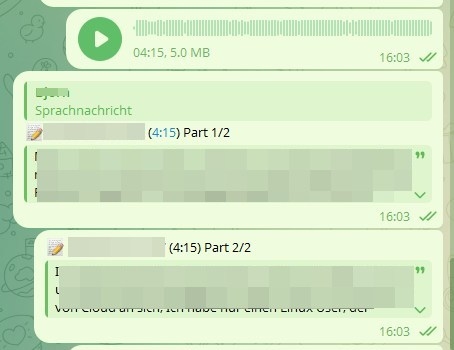
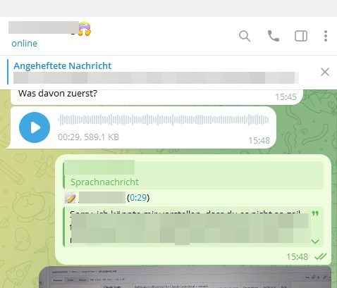

# 🎙️ voxscribe — Telegram Voice Transcription Bot


> Turn every voice message into clean, readable text — automatically, on your own Telegram account, in **any** chat.

A self-hosted Telegram **userbot** that transcribes voice messages in real time using AI speech recognition. It works in **1-on-1 DMs and group chats alike**, listens to incoming **and** outgoing voices, optionally rephrases the transcription into polished text, and can clean up the original audio afterwards — all controlled per chat with simple slash commands.

---

## ✨ Features

- 🎙️ **Automatic transcription** — every voice message becomes text, in DMs *and* groups
- 👥 **Per-chat control** — each 1:1 and each group keeps its own independent settings
- 🔁 **Two directions** — transcribe what you *receive*, what you *send*, or both
- 🧠 **AI rephrasing** — optionally clean up filler words while keeping your tone & style
- ⚡ **Built for speed** — Groq's LPU or OpenAI Whisper, your choice per task
- 🎛️ **Mixed mode** — e.g. Groq for fast transcription, OpenAI for high-quality rephrasing
- 🧹 **Auto cleanup** — delete the original voice note after transcription
- 🩺 **Self-healing** — a connection watchdog restarts the bot cleanly on network failures
- 🔐 **Self-hosted** — runs as a userbot under your account; no third-party storage
- 🌍 **Multilingual** — transcribes in the original spoken language

---

## 📸 Screenshots

<table>
  <tr>
    <td width="50%"></td>
    <td width="50%"></td>
  </tr>
  <tr>
    <td align="center"><em>Long voice notes are split into parts (1/2, 2/2)</em></td>
    <td align="center"><em>Each transcript is posted as a reply with sender &amp; duration</em></td>
  </tr>
</table>

---

## 🚀 How It Works

1. The bot watches your account for voice messages in all your chats (DMs and groups).
2. A voice arrives → it downloads and transcribes the audio.
3. *(Optional)* It rephrases the transcription for readability.
4. The text is posted as a reply to the original voice message.
5. *(Optional)* The original voice note is deleted to keep the chat tidy.

> 💡 **Pro tip:** Run any command from a chat's *Scheduled Messages* view to keep both the
> command **and** its reply invisible to your chat partner.

---

## 👥 1-on-1 vs. Group Chats

The bot reacts to voice messages in **every** chat type — direct messages, groups and
supergroups. Each chat is configured **independently** (settings are keyed by chat ID), so
you decide per conversation what happens.

> ⚡ **Important — it's ON everywhere by default.** Transcription is automatically active in
> **every** chat the bot hasn't seen before (DMs *and* groups). There is no per-chat opt-in:
> if you don't want it in a particular group, you have to **turn it off there** with `/toff`.
> You can flip this default with **`transcription_enabled_new_chats: false`** in `config.yaml`
> (see the **Configuration** section) — then new chats stay silent until you `/ton` them.

| | **1-on-1 (DM)** | **Group / Supergroup** |
|---|---|---|
| **Incoming** voice | your partner's voice notes | voice notes from *any* member |
| **Outgoing** voice | your own voice notes | your own voice notes |
| **Settings scope** | this DM only | this group only |
| **Who can run commands** | only you (the account owner) | only you — never other members |
| **Where the reply appears** | private between you two | **visible to the whole group** |

**How to adjust a specific chat** — send the command **inside that exact chat**; it only
affects that one conversation (the setting is stored under that chat's ID). Since
transcription is already ON everywhere, this is mostly about turning things **off**:

```
/toff       → master switch OFF for THIS chat (silences it entirely, e.g. a noisy group)
/ton        → master switch ON for THIS chat
/tin        → toggle only the incoming direction (others' voices) in THIS chat
/tout       → toggle only the outgoing direction (your own voices) in THIS chat
```

`/toff` overrides the direction toggles: while a chat is off, `/tin` / `/tout` have no effect
until you `/ton` it again.

> ⚠️ **Group privacy:** Because this is a **userbot**, every transcription is posted **as you**
> into the chat — in a group that means **all members see it**. If you only want transcriptions
> for yourself in a noisy group, either keep them in your DMs, or use `/toff` to mute the bot
> there. The *Scheduled Messages* trick keeps things invisible in **1-on-1** chats only.

> 🤖 Voice notes sent by **bots** are skipped automatically.

---

## 📋 Prerequisites

- **Python 3.10+**
- A **Telegram account** + free API credentials from [my.telegram.org](https://my.telegram.org/)
- An AI provider key — pick one (or both):
  - **Groq** — free tier, extremely fast *(recommended)*
  - **OpenAI** — paid, very accurate

---

## 📦 Installation

```bash
# 1. Clone
git clone https://github.com/bjspi/voxscribe.git
cd voxscribe

# 2. Virtual environment
python -m venv venv
source venv/bin/activate        # Windows: venv\Scripts\activate

# 3. Dependencies
pip install -r requirements.txt
```

---

## ⚙️ Configuration

All settings live in **`config.yaml`** (gitignored — your secrets stay local).

```bash
cp config.example.yaml config.yaml
```

Then fill in your credentials:

```yaml
telegram:
  api_id: "123456"
  api_hash: "your_telegram_api_hash"
  phone_nr: "+49123456789"
  account: "@your_username"

api:
  provider:
    transcription: "GROQ"     # GROQ or OPENAI
    rephrase: "GROQ"          # GROQ or OPENAI
  keys:
    openai: ""                # required if using OPENAI
    groq: ""                  # required if using GROQ

models:
  groq:
    transcription: "whisper-large-v3"
    rephrase: "openai/gpt-oss-120b"
  openai:
    transcription: "whisper-1"
    rephrase: "gpt-4o-mini"
```

### ✍️ Tune your prompts (do this first!)

The two prompts under `prompts:` in `config.yaml` have the **biggest impact on output
quality** — take a minute to adapt them before relying on the bot:

- **`prompts.transcription`** steers the speech-to-text model. Add your own **jargon, names,
  product/brand names and recurring topics** so they get spelled correctly, and set the
  expected punctuation/capitalization style.
- **`prompts.rephrase`** steers how the transcript is cleaned up afterwards — control the
  tone, how aggressively filler words are removed, and how much restructuring is allowed.

Both prompts ship with sensible English defaults in `config.example.yaml`; treat them as a
starting point and make them yours. Per-chat overrides are also possible via `/setprompt`,
`/setprompt_in` and `/setprompt_out`.

### 🔀 Mixed Mode

Use a different provider for each task — fast transcription, high-quality rephrasing:

```yaml
api:
  provider:
    transcription: "GROQ"     # ⚡ fast
    rephrase: "OPENAI"        # 🧠 high quality
```

> **Backward compatible:** if you set `provider` to a single string instead of a
> `transcription`/`rephrase` pair, that one provider is used for both tasks:
> ```yaml
> api:
>   provider: "GROQ"          # used for transcription AND rephrasing
> ```

### 🔑 Getting your keys

| Service | Where | Notes |
|---|---|---|
| **Telegram API** | [my.telegram.org](https://my.telegram.org/) → *API development tools* | Free. Copy `api_id` + `api_hash`. |
| **Groq** | [console.groq.com](https://console.groq.com/) | Free tier, no credit card. |
| **OpenAI** | [platform.openai.com](https://platform.openai.com/) | Pay-as-you-go. |

### 🎚️ Behaviour & privacy settings

A few optional toggles in `config.yaml` control defaults and logging:

```yaml
# Transcribe by default in chats the bot has never seen before?
#   true  (default) → ON everywhere, opt OUT per chat with /toff
#   false           → silent in new chats until you opt IN with /ton
transcription_enabled_new_chats: true

logging:
  retention_days: 10
  # Log full message content (transcripts, prompts, results)?
  #   false (default) → only a short, redacted preview is logged (privacy-friendly)
  #   true            → full content in the logs (useful for debugging)
  verbose: false
```

| Setting | Default | Effect |
|---|---|---|
| `transcription_enabled_new_chats` | `true` | Whether a brand-new chat (not yet in `chats.json`) transcribes automatically. Existing chats keep their own saved setting. |
| `logging.verbose` | `false` | When off, transcription/rephrasing content is logged only as a ~200-char preview. Turn on to log full content while debugging. |

---

## ▶️ First Run

```bash
python bot.py
```

On the **first** launch you'll authenticate your Telegram account:
- Enter the verification code sent to Telegram
- Confirm the login on your other devices

The session is stored in `session/` (gitignored) so you only log in once.

---

## 💬 Commands

Send these **in the chat you want to configure** (a DM or a group). Only you can trigger
them — other group members can't. In 1-on-1 chats, sending via *Scheduled Messages* keeps
them invisible to your partner.

| Command | Action |
|---|---|
| `/helpv` | Show all commands + current settings |
| `/statusv` | Show current transcription settings |
| `/ton` | Enable transcription globally for this chat |
| `/toff` | Disable transcription globally for this chat |
| `/tin` | Toggle transcription of **incoming** voices |
| `/tout` | Toggle transcription of **outgoing** voices |
| `/rephrase` | Toggle AI rephrasing of transcriptions |
| `/delin` | Toggle deletion of **incoming** voices after transcription |
| `/delout` | Toggle deletion of **outgoing** voices after transcription |
| `/prompt` | Show the current rephrasing prompt |
| `/prompts` | Show prompts overview (custom / default) |
| `/setprompt` | Set a custom rephrasing prompt |
| `/setprompt_in` | Set a custom rephrasing prompt for incoming messages |
| `/setprompt_out` | Set a custom rephrasing prompt for outgoing messages |

### 🧩 The naming logic (so you never need the cheat sheet)

The commands are built from small, memorable building blocks:

| Block | Means | Mnemonic |
|---|---|---|
| `t…` | **t**ranscription | `ton` `toff` `tin` `tout` |
| `del…` | **del**ete the voice note | `delin` `delout` |
| `…in` / `…out` | direction — **in**coming vs **out**going | `tin` / `tout`, `delin` / `delout` |
| `on` / `off` | global on/off for the chat | `ton` / `toff` |
| `…v` | the **v**oice-bot namespace (avoids clashing with `/help` etc.) | `helpv` `statusv` |

So `tin` = **t**ranscribe **in**coming (toggle), `delout` = **del**ete **out**going, `ton` =
**t**ranscription **on**. Once it clicks, you'll never open `/helpv` again.

---

## ⚡ Why Groq?

- **Speed** — Groq's LPU inference is blisteringly fast
- **Free tier** — generous limits, no credit card
- **Quality** — comparable accuracy to OpenAI Whisper

*Free-tier limits (2025): ~10,000 requests/day, ~10 requests/min — plenty for personal use.*

---

## 🩺 Reliability

A background **connection watchdog** pings Telegram on an interval. After repeated failures it raises a `ConnectionHealthError` and exits with a non-zero code, so a process manager
(**supervisor / systemd / PM2**) can restart the bot cleanly — no infinite reconnect loops.

### 🔁 Hard-exit vs. keep-alive

Whether the bot actually exits on connection loss is controlled by
**`recovery.watchdog_hard_exit`** in `config.yaml`:

| Value | Behaviour | Use when |
|---|---|---|
| `true` *(default)* | After `telegram_healthcheck_max_failures` failed checks the bot **exits with code 1** so your process manager restarts it. | You run it under supervisor / systemd / PM2. |
| `false` | The bot **keeps running**, resets the counter and relies on Pyrogram's built-in **auto-reconnect**. | You run `python bot.py` directly, without a process manager. |

<details>
<summary>Example supervisor config</summary>

```ini
[program:voice_transcription]
command=/path/to/venv/bin/python /path/to/bot.py
directory=/path/to/voice_transcriber
autostart=true
autorestart=true
startretries=10
stderr_logfile=/var/log/voice_transcription.err.log
stdout_logfile=/var/log/voice_transcription.out.log
```
</details>

Tune the watchdog in `config.yaml` under `recovery:` (interval, timeout, max failures, shutdown timeout, hard-exit).

---

## 🗂️ Project Structure

```
voxscribe/
├── bot.py                  # Entry point — python bot.py
├── requirements.txt
├── config.example.yaml     # template (committed)
├── config.yaml             # your secrets (gitignored)
├── chats.json              # per-chat settings (gitignored, auto-created)
├── src/
│   ├── handlers.py         # command + voice handlers
│   ├── transcription.py    # transcription & rephrasing logic
│   ├── helpers.py          # config loading, message utils
│   └── logging.py          # central logging setup
├── session/                # Telegram session files (gitignored)
└── logs/                   # daily rotating logs (gitignored)
```

---

## 🗃️ Per-chat settings (`chats.json`)

Every chat the bot interacts with gets its own entry in `chats.json`, keyed by the numeric
**Telegram chat ID**. The file is created and updated automatically whenever you run a command
or a voice is transcribed — you normally never edit it by hand. It is **gitignored** (it maps
your private chats) and written atomically, with a `.json.backup` kept alongside it.

```jsonc
{
    "11122233": {                  // chat ID (a person or a group)
        "chatname": "ALICE",       // cached display name, just for readability
        "transcription": 1,        // master switch for this chat   (/ton · /toff)
        "transcription_in": 1,     // transcribe incoming voices     (/tin)
        "transcription_out": 1,    // transcribe your own voices     (/tout)
        "rephrasing": 0,           // AI rephrasing on/off           (/rephrase)
        "delete_incoming_voice": 0,// delete incoming after text     (/delin)
        "delete_outgoing_voice": 0,// delete outgoing after text     (/delout)
        "rephrase_prompt": "",     // legacy/global custom prompt
        "rephrase_prompt_in": "",  // custom prompt, incoming         (/setprompt_in)
        "rephrase_prompt_out": ""  // custom prompt, outgoing         (/setprompt_out)
    },
    "44455566": {                  // partial entries are fine — missing
        "transcription": 1         // keys fall back to the defaults
    }
}
```

- Values are `1` (on) / `0` (off); prompt fields are strings (empty = use the global prompt).
- **Missing keys fall back to defaults**, so a minimal `{ "transcription": 1 }` entry is valid.
- A chat with **no entry at all** uses `transcription_enabled_new_chats` to decide whether it
  starts ON or OFF (see the **Configuration** section).

---

## 🛠️ Troubleshooting

| Problem | Fix |
|---|---|
| `TgCrypto is missing` warning | Harmless; `pip install tgcrypto` to silence and speed up |
| Authentication errors | Verify `api_id` / `api_hash`; phone number in international format (`+49…`) |
| API key errors | Check the key is active and the matching `provider` is set |

**Logs:** one file per day in `logs/bot_YYYYMMDD.log`. Retention is configurable via
`logging.retention_days` in `config.yaml` (default: 10 days).

---

## 🤝 Contributing

1. Fork the repo
2. Create a feature branch
3. Commit your changes
4. Push and open a Pull Request

---

## 📄 License

Released under the **MIT License** — see [LICENSE](LICENSE).

---

## 🙏 Acknowledgments

- [Pyrogram](https://docs.pyrogram.org/) — Telegram MTProto framework
- [OpenAI Whisper](https://openai.com/) — speech recognition
- [Groq](https://groq.com/) — ultra-fast LLM inference
- [PyYAML](https://pyyaml.org/) — YAML parsing

---

## ⚖️ Disclaimer

This is a **userbot** that automates actions on your personal Telegram account. Use it
responsibly and in line with [Telegram's Terms of Service](https://telegram.org/tos). The
authors are not responsible for misuse or account restrictions.
