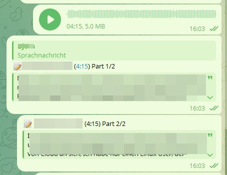
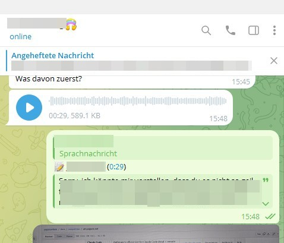

# 🎙️ voxscribe — Telegram Voice Transcription Bot


> Turn every voice message into clean, readable text — automatically, on your own Telegram account, in **any** chat.

A self-hosted Telegram **userbot** that transcribes voice messages in real time using AI speech recognition. It works in **1-on-1 DMs and group chats alike**, listens to incoming **and** outgoing voices, optionally rephrases the transcription into polished text, and can clean up the original audio afterwards — all controlled per chat with simple slash commands or, optionally, a button-driven control bot.

---

## ✨ Features

- 🎙️ **Automatic transcription** — every voice message becomes text, in DMs *and* groups
- 👥 **Per-chat control** — each 1:1 and each group keeps its own independent settings
- 🔁 **Two directions** — transcribe what you *receive*, what you *send*, or both
- 🧠 **AI rephrasing** — optionally clean up filler words while keeping your tone & style
- 📄 **Markdown files per chat** — send the original transcript and rephrased version together in one `.md` attachment; off by default
- 🎛️ **Control bot** — an optional BotFather bot with an inline-button menu: see every chat, add / pause / delete chats and flip *all* per-chat settings from one place
- 🧩 **Prompt templates** — freely configurable rephrasing templates (with summary, summary only, bullet points, verbatim, …) selectable per chat and direction
- ⚡ **Built for speed** — Groq's LPU or OpenAI Whisper, your choice per task
- 🎛️ **Mixed mode** — e.g. Groq for fast transcription, OpenAI for high-quality rephrasing
- 🧹 **Auto cleanup** — delete the original voice note after transcription
- 🩺 **Self-healing** — a connection watchdog restarts the bot cleanly on network failures
- 🔐 **Self-hosted** — runs as a userbot under your account; no third-party storage
- 🌍 **Multilingual** — transcribes in the original spoken language

---

## 📸 Screenshots

<table>
  <tr>
    <td width="50%"></td>
    <td width="50%"></td>
  </tr>
  <tr>
    <td align="center"><em>Long voice notes are split into parts (1/2, 2/2)</em></td>
    <td align="center"><em>Each transcript is posted as a reply with sender &amp; duration</em></td>
  </tr>
</table>

---

## 🚀 How It Works

1. The bot watches your account for voice messages in all your chats (DMs and groups).
2. A voice arrives → it downloads and transcribes the audio.
3. *(Optional)* It rephrases the transcription for readability.
4. The text is posted as a reply to the original voice message.
5. *(Optional)* The original voice note is deleted to keep the chat tidy.

> 💡 **Pro tip:** Run any command from a chat's *Scheduled Messages* view to keep both the
> command **and** its reply invisible to your chat partner — or skip in-chat commands entirely
> and manage every chat from the optional [control bot](#control-bot).

---

## 👥 1-on-1 vs. Group Chats

The bot reacts to voice messages in **every** chat type — direct messages, groups and
supergroups. Each chat is configured **independently** (settings are keyed by chat ID), so
you decide per conversation what happens.

> ⚡ **Important — it's ON everywhere by default.** Transcription is automatically active in
> **every** chat the bot hasn't seen before (DMs *and* groups). There is no per-chat opt-in:
> if you don't want it in a particular group, you have to **turn it off there** with `/toff`.
> You can flip this default with **`transcription_enabled_new_chats: false`** in `config.yaml`
> (see the **Configuration** section) — then new chats stay silent until you `/ton` them.

| | **1-on-1 (DM)** | **Group / Supergroup** |
|---|---|---|
| **Incoming** voice | your partner's voice notes | voice notes from *any* member |
| **Outgoing** voice | your own voice notes | your own voice notes |
| **Settings scope** | this DM only | this group only |
| **Who can run commands** | only you (the account owner) | only you — never other members |
| **Where the reply appears** | private between you two | **visible to the whole group** |

**How to adjust a specific chat** — send the command **inside that exact chat**; it only
affects that one conversation (the setting is stored under that chat's ID). Since
transcription is already ON everywhere, this is mostly about turning things **off**:

```
/toff       → master switch OFF for THIS chat (silences it entirely, e.g. a noisy group)
/ton        → master switch ON for THIS chat
/tin        → toggle only the incoming direction (others' voices) in THIS chat
/tout       → toggle only the outgoing direction (your own voices) in THIS chat
```

`/toff` overrides the direction toggles: while a chat is off, `/tin` / `/tout` have no effect
until you `/ton` it again.

> ⚠️ **Group privacy:** Because this is a **userbot**, every transcription is posted **as you**
> into the chat — in a group that means **all members see it**. If you only want transcriptions
> for yourself in a noisy group, either keep them in your DMs, or use `/toff` to mute the bot
> there. The *Scheduled Messages* trick keeps things invisible in **1-on-1** chats only.

> 🤖 Voice notes sent by **bots** are skipped automatically.

---

## 📋 Prerequisites

- **Python 3.10+**
- A **Telegram account** + free API credentials from [my.telegram.org](https://my.telegram.org/)
- An AI provider key — pick one (or both):
  - **Groq** — free tier, extremely fast *(recommended)*
  - **OpenAI** — paid, very accurate

---

## 📦 Installation

```bash
# 1. Clone
git clone https://github.com/bjspi/voxscribe.git
cd voxscribe

# 2. Virtual environment
python -m venv venv
source venv/bin/activate        # Windows: venv\Scripts\activate

# 3. Dependencies
pip install -r requirements.txt
```

---

## ⚙️ Configuration

All settings live in **`config.yaml`** (gitignored — your secrets stay local).

```bash
cp config.example.yaml config.yaml
```

Then fill in your credentials:

```yaml
telegram:
  api_id: "123456"
  api_hash: "your_telegram_api_hash"
  phone_nr: "+49123456789"
  account: "@your_username"

api:
  provider:
    transcription: "GROQ"     # GROQ or OPENAI
    rephrase: "GROQ"          # GROQ or OPENAI
  keys:
    openai: ""                # required if using OPENAI
    groq: ""                  # required if using GROQ

models:
  groq:
    transcription: "whisper-large-v3"
    rephrase: "openai/gpt-oss-120b"
  openai:
    transcription: "whisper-1"
    rephrase: "gpt-4o-mini"
```

### ✍️ Tune your prompts (do this first!)

The two prompts under `prompts:` in `config.yaml` have the **biggest impact on output
quality** — take a minute to adapt them before relying on the bot:

- **`prompts.transcription`** steers the speech-to-text model. Add your own **jargon, names,
  product/brand names and recurring topics** so they get spelled correctly, and set the
  expected punctuation/capitalization style.
- **`prompts.rephrase`** steers how the transcript is cleaned up afterwards — control the
  tone, how aggressively filler words are removed, and how much restructuring is allowed.

Both prompts ship with sensible English defaults in `config.example.yaml`; treat them as a
starting point and make them yours. Per-chat overrides are also possible via `/setprompt`,
`/setprompt_in` and `/setprompt_out` — or by picking a **prompt template** in the control bot.

<a id="prompt-templates"></a>
### 🧩 Prompt templates

Templates are named rephrasing prompts you can assign **per chat and per direction**
(incoming / outgoing) through the [control bot](#control-bot). They live under
`prompts.templates` in `config.yaml`:

```yaml
prompts:
  rephrase: |
    ...your default rephrasing prompt...

  templates:
    - key: summary                     # short id, max 24 chars, no "|"
      name: "Clean-up + summary"       # shown on the buttons
      prompt: |
        {default_prompt}               # expands to prompts.rephrase

        **Additional rule — summary**
        Start your answer with a one- or two-sentence summary prefixed with "TL;DR:",
        followed by a blank line and then the revised text.
    - key: summary_only
      name: "Summary only"
      prompt: |
        Return only a concise summary of the message as at most five bullet points ...
```

- The placeholder **`{default_prompt}`** expands to your tuned `prompts.rephrase`, so
  "default rules + something extra" templates never drift from the default.
- A chat stores only the template **key**. Editing a template in `config.yaml` changes the
  behaviour of every chat using it immediately — no restart, no re-assigning.
- Four templates ship built in and are used when the `templates` list is absent:
  **Clean-up + summary**, **Summary only**, **Bullet points** and **Verbatim (minimal
  edits)**. Copy them from `config.example.yaml` to adapt them, or set `templates: []` to
  offer none.
- Precedence per direction: a **custom prompt** typed for the chat (`/setprompt_in`,
  `/setprompt_out` or *Custom text…* in the control bot) beats a **template**, which beats
  the global **default**. Typing a custom prompt clears the template for that direction;
  choosing a template or *Default* clears the custom text.

### 🔀 Mixed Mode

Use a different provider for each task — fast transcription, high-quality rephrasing:

```yaml
api:
  provider:
    transcription: "GROQ"     # ⚡ fast
    rephrase: "OPENAI"        # 🧠 high quality
```

> **Backward compatible:** if you set `provider` to a single string instead of a
> `transcription`/`rephrase` pair, that one provider is used for both tasks:
> ```yaml
> api:
>   provider: "GROQ"          # used for transcription AND rephrasing
> ```

### 🔑 Getting your keys

| Service | Where | Notes |
|---|---|---|
| **Telegram API** | [my.telegram.org](https://my.telegram.org/) → *API development tools* | Free. Copy `api_id` + `api_hash`. |
| **Groq** | [console.groq.com](https://console.groq.com/) | Free tier, no credit card. |
| **OpenAI** | [platform.openai.com](https://platform.openai.com/) | Pay-as-you-go. |

### 🎚️ Behaviour & privacy settings

A few optional toggles in `config.yaml` control defaults and logging:

```yaml
# Transcribe by default in chats the bot has never seen before?
#   true  (default) → ON everywhere, opt OUT per chat with /toff
#   false           → silent in new chats until you opt IN with /ton
transcription_enabled_new_chats: true

logging:
  retention_days: 10
  # Log full message content (transcripts, prompts, results)?
  #   false (default) → only a short, redacted preview is logged (privacy-friendly)
  #   true            → full content in the logs (useful for debugging)
  verbose: false
```

| Setting | Default | Effect |
|---|---|---|
| `transcription_enabled_new_chats` | `true` | Whether a brand-new chat (not yet in `chats.json`) transcribes automatically. Existing chats keep their own saved setting. |
| `logging.verbose` | `false` | When off, transcription/rephrasing content is logged only as a ~200-char preview. Turn on to log full content while debugging. |
| `control_bot.token` | *(empty)* | BotFather token of the optional [control bot](#control-bot). Empty = disabled. |
| `control_bot.owner_id` | `0` | Your numeric Telegram user id — the only user allowed to talk to the control bot. Required when a token is set. |
| `prompts.templates` | *(built-in)* | List of [prompt templates](#prompt-templates) selectable per chat. |

---

## ▶️ First Run

```bash
python bot.py
```

On the **first** launch you'll authenticate your Telegram account:
- Enter the verification code sent to Telegram
- Confirm the login on your other devices

The session is stored in `session/` (gitignored) so you only log in once.

---

## 💬 Commands

Send these **in the chat you want to configure** (a DM or a group). Only you can trigger
them — other group members can't. In 1-on-1 chats, sending via *Scheduled Messages* keeps
them invisible to your partner.

| Command | Action |
|---|---|
| `/helpv` | Show all commands + current settings |
| `/statusv` | Show current transcription settings |
| `/vox` | Show **every** setting of this chat (state, direction, output, rephrasing, deletion, prompts) together with the command that changes it |
| `/ton` | Enable transcription globally for this chat |
| `/toff` | Disable transcription globally for this chat |
| `/tin` | Toggle transcription of **incoming** voices |
| `/tout` | Toggle transcription of **outgoing** voices |
| `/rephrase` | Toggle AI rephrasing of transcriptions |
| `/tmd [on\|off]` | Toggle Markdown attachments for this chat, or explicitly enable/disable them (default: off) |
| `/delin` | Toggle deletion of **incoming** voices after transcription |
| `/delout` | Toggle deletion of **outgoing** voices after transcription |
| `/prompt` | Show the current rephrasing prompt |
| `/prompts` | Show prompts overview (custom / default) |
| `/setprompt` | Set a custom rephrasing prompt |
| `/setprompt_in` | Set a custom rephrasing prompt for incoming messages |
| `/setprompt_out` | Set a custom rephrasing prompt for outgoing messages |

### 📄 Markdown attachments

Send `/tmd on` in a chat to receive **one Markdown file per voice** instead of split
text messages. The file contains the **original speech-to-text transcript** and the
**rephrased version**, under separate headings, with the sender and voice duration.
Both texts are included in full and retain their paragraphs and Markdown formatting.

Files are named after the voice timestamp (`YYYYMMDD_HHhMMm`), the sender's Telegram
username and the duration, for example `20260907_08h43m_alex_14m03s.md`, so they sort
chronologically in any folder. If there is no username, the sender's display name or ID
is used; characters unsuitable for filenames are replaced with underscores. The file is
sent without a caption; only provider fallback or rephrasing warnings appear as caption.

Markdown mode always requests both versions using the configured providers and prompts,
even if `/rephrase` is off for normal text messages. If rephrasing fails, the file still
contains the original transcript and clearly marks the rephrased version as unavailable.
The original transcript is the speech recognition provider's output; it is preserved
before the separate rephrasing step.

This setting applies independently to each chat and to both enabled voice directions.
It is **off by default**, including for existing chats. `/tmd off` restores text messages;
`/tmd` without an argument toggles the setting. `/statusv` shows its current state.
The existing transcription and voice-deletion settings still apply.

### 🎙️ `/vox` — the whole chat configuration at a glance

`/vox` prints a compact panel with the current value of **every** per-chat setting next to
the slash command that changes it — master switch, incoming / outgoing, output mode
(inline text or Markdown file), rephrasing, voice deletion and the active rephrasing prompt
per direction (*Default*, *Template: …* or *Custom*). Like all other commands it deletes
itself after a few seconds and works from *Scheduled Messages* too.

```
🎙️ voxscribe — chat settings
Alice (11122233)

Transcription ✅ on             /ton · /toff
  Incoming    ✅ on             /tin
  Outgoing    ✅ on             /tout
Output        💬 inline text    /tmd on|off
Rephrasing    ✅ on             /rephrase
Delete voice
  Incoming    ❌ off            /delin
  Outgoing    ❌ off            /delout
Prompt in     Default           /setprompt_in
Prompt out    Template: Clean-up + summary   /setprompt_out
```

### 🧩 The naming logic (so you never need the cheat sheet)

The commands are built from small, memorable building blocks:

| Block | Means | Mnemonic |
|---|---|---|
| `t…` | **t**ranscription | `ton` `toff` `tin` `tout` |
| `del…` | **del**ete the voice note | `delin` `delout` |
| `…in` / `…out` | direction — **in**coming vs **out**going | `tin` / `tout`, `delin` / `delout` |
| `on` / `off` | global on/off for the chat | `ton` / `toff` |
| `…v` | the **v**oice-bot namespace (avoids clashing with `/help` etc.) | `helpv` `statusv` |

So `tin` = **t**ranscribe **in**coming (toggle), `delout` = **del**ete **out**going, `ton` =
**t**ranscription **on**. Once it clicks, you'll never open `/helpv` again.

---

<a id="control-bot"></a>
## 🎛️ Control bot (optional)

Slash commands are great inside a chat, but they only ever configure *that* chat. The
**control bot** gives you one private place to see and manage **all** chats: a regular
BotFather bot with an inline-button menu that runs next to the userbot, in the same process,
and edits the same `chats.json` — every tap applies to the next voice message immediately.

<table>
  <tr>
    <th>Main menu</th>
    <th>Chat settings</th>
    <th>Prompt picker</th>
  </tr>
  <tr>
    <td valign="top"><pre>🎛 Voice Transcriber — Control

[ 📊 Status ]
[ 💬 Chats ] [ 🧩 Prompt templates ]</pre></td>
    <td valign="top"><pre>💬 Alice  11122233

State:       ▶️ active
Direction:   both
Output:      💬 inline text
Rephrasing:  on
Delete voice: incoming off · outgoing off
Prompt in:   Default
Prompt out:  Template: Clean-up + summary

[ ⏸ Pause chat ]
— Direction —
[ ▫️ Incoming ] [ ▫️ Outgoing ] [ ✅ Both ]
— Output —
[ ✅ 💬 Inline text ] [ ▫️ 📄 Markdown file ]
— Rephrasing —
[ ✅ 🧠 AI rephrasing ]
— Delete voice after transcription —
[ ▫️ 🗑 Incoming ] [ ▫️ 🗑 Outgoing ]
[ 🧩 Prompts ]
[ 🗑 Delete chat ]
[ ⬅️ Back ]</pre></td>
    <td valign="top"><pre>🧩 Alice  11122233

Choose the rephrasing prompt
for outgoing voices.

[ ▫️ 🌐 Default (config.yaml) ]
[ ✅ Clean-up + summary ]
[ ▫️ Summary only ]
[ ▫️ Bullet points ]
[ ▫️ Verbatim (minimal edits) ]
[ ▫️ ✍️ Custom text… ]
[ ⬅️ Back ]</pre></td>
  </tr>
</table>

### What you can do

| Screen | Actions |
|---|---|
| **📊 Status** | Providers and models in use, number of templates, active / paused chat counts, a one-line summary per chat (`▶️ Alice · both · 💬 text · 🧠`). |
| **💬 Chats** | Every configured chat as a button (paged, 12 per page, unnamed chats last). **➕ Add chat** picks from your 20 most recently active dialogs or takes a typed id / `@username`. |
| **Chat settings** | **Pause / resume** (master switch), **direction** (incoming / outgoing / both), **output** (inline text or Markdown file), **AI rephrasing**, **delete voice** after transcription per direction, and **🗑 Delete chat** (always behind a confirm screen). |
| **🧩 Prompts** | Per direction: pick a **template**, fall back to the global **default**, or type a **custom prompt** as a message. *Set both directions* applies one choice to incoming and outgoing. *View* shows the full active prompt text. |
| **🧩 Prompt templates** | Read-only list of the templates from `config.yaml`, with the `{default_prompt}` placeholder expanded so you see exactly what the model gets. |

Everything the buttons change is the same data the slash commands change, so you can mix
both freely; `/vox` in a chat always shows the current state.

### Setup

1. Create a bot with [@BotFather](https://t.me/BotFather) (`/newbot`) and copy the token.
2. Find your own numeric user id, e.g. via [@userinfobot](https://t.me/userinfobot).
3. Add both to `config.yaml` and restart the bot:

   ```yaml
   control_bot:
     token: "123456789:AAExampleTokenFromBotFather"
     owner_id: 123456789
   ```

4. Open your new bot in Telegram and send `/menu` (or `/start`, `/chats`, `/status`).

The bot's session is stored as `session/control_bot.session` (gitignored). A wrong token
only logs an error — the userbot keeps transcribing without the menu.

### Security

- The control bot is **locked to a single user id**: it only reacts in the private chat with
  the owner. Messages from anyone else are never answered, only logged with the sender's id
  (which is also the easiest way to find your own id: message the bot once and read the log).
- Without `owner_id` the bot **refuses to start**, so it can never be left open by accident.
- Destructive actions (deleting a chat) always go through an explicit confirm screen.
- It never touches your Telegram account: chat lookups for *Add chat* go through the userbot,
  everything else is a `chats.json` edit.

---

## ⚡ Why Groq?

- **Speed** — Groq's LPU inference is blisteringly fast
- **Free tier** — generous limits, no credit card
- **Quality** — comparable accuracy to OpenAI Whisper

*Free-tier limits (2025): ~10,000 requests/day, ~10 requests/min — plenty for personal use.*

---

## 🩺 Reliability

A background **connection watchdog** pings Telegram on an interval. When a check fails, a
lightweight WAN probe (the `generate_204` endpoints from Google and Cloudflare — built for
exactly this kind of continuous connectivity checking, and only ever contacted while Telegram
is already unreachable) classifies the outage:

- **Internet down** — a restart cannot bring the line back, so the watchdog waits it out.
  Pyrogram reconnects on its own once the line returns; the give-up clock is paused.
- **Internet up, Telegram unreachable** — the give-up clock runs. Once *both* thresholds are
  exceeded — enough consecutive failures to rule out a single blip
  (`telegram_healthcheck_max_failures`) and `telegram_healthcheck_max_unhealthy_seconds`
  (default 900) of continuous Telegram-only failure — the watchdog raises a
  `ConnectionHealthError` and exits with a non-zero code, so a process manager
  (**supervisor / systemd / PM2**) can restart the bot cleanly. That is the stuck-session
  case a restart actually fixes — never a restart loop through a long line outage.

### 🔁 Hard-exit vs. keep-alive

Whether the bot actually exits on connection loss is controlled by
**`recovery.watchdog_hard_exit`** in `config.yaml`:

| Value | Behaviour | Use when |
|---|---|---|
| `true` *(default)* | When the watchdog gives up (see above), the bot **exits with code 1** so your process manager restarts it. | You run it under supervisor / systemd / PM2. |
| `false` | The bot **keeps running**, resets the counter and relies on Pyrogram's built-in **auto-reconnect**. | You run `python bot.py` directly, without a process manager. |

<details>
<summary>Example supervisor config</summary>

```ini
[program:voice_transcription]
command=/path/to/venv/bin/python /path/to/bot.py
directory=/path/to/voice_transcriber
autostart=true
autorestart=true
startretries=10
stderr_logfile=/var/log/voice_transcription.err.log
stdout_logfile=/var/log/voice_transcription.out.log
```
</details>

Tune the watchdog in `config.yaml` under `recovery:` (interval, timeout, max failures, shutdown timeout, hard-exit).

---

## 🗂️ Project Structure

```
voxscribe/
├── bot.py                  # Entry point — python bot.py
├── requirements.txt
├── config.example.yaml     # template (committed)
├── config.yaml             # your secrets (gitignored)
├── chats.json              # per-chat settings (gitignored, auto-created)
├── src/
│   ├── handlers.py         # command + voice handlers
│   ├── transcription.py    # transcription & rephrasing logic
│   ├── prompts.py          # prompt templates + per-chat prompt resolution
│   ├── helpers.py          # config loading, chats.json store, message utils
│   ├── logging.py          # central logging setup
│   └── control_bot/        # optional BotFather control bot (menu UI)
│       ├── service.py      #   client factory + slash-command menu
│       ├── handlers.py     #   owner-only Pyrogram handlers
│       ├── router.py       #   callback data -> screen + config change
│       ├── keyboards.py    #   inline keyboards (callback-data scheme)
│       ├── views.py        #   screen texts (HTML)
│       ├── chats.py        #   recent dialogs / id lookup via the userbot
│       └── state.py        #   pending multi-step flows
├── tests/                  # unit tests (python -m pytest)
├── session/                # Telegram + control-bot session files (gitignored)
└── logs/                   # daily rotating logs (gitignored)
```

---

## 🗃️ Per-chat settings (`chats.json`)

Every chat the bot interacts with gets its own entry in `chats.json`, keyed by the numeric
**Telegram chat ID**. The file is created and updated automatically whenever you run a command
or a voice is transcribed — you normally never edit it by hand. It is **gitignored** (it maps
your private chats) and written atomically, with a `.json.backup` kept alongside it.

```jsonc
{
    "11122233": {                  // chat ID (a person or a group)
        "chatname": "ALICE",       // cached display name, just for readability
        "transcription": 1,        // master switch for this chat   (/ton · /toff)
        "transcription_in": 1,     // transcribe incoming voices     (/tin)
        "transcription_out": 1,    // transcribe your own voices     (/tout)
        "rephrasing": 0,           // AI rephrasing on/off           (/rephrase)
        "markdown_output": 0,      // one .md: original + rephrased  (/tmd)
        "delete_incoming_voice": 0,// delete incoming after text     (/delin)
        "delete_outgoing_voice": 0,// delete outgoing after text     (/delout)
        "rephrase_prompt": "",     // legacy/global custom prompt
        "rephrase_prompt_in": "",  // custom prompt, incoming         (/setprompt_in)
        "rephrase_prompt_out": "", // custom prompt, outgoing         (/setprompt_out)
        "rephrase_template_in": "",        // key of a prompts.templates entry (control bot)
        "rephrase_template_out": "summary" // "" = none; a custom prompt above wins
    },
    "44455566": {                  // partial entries are fine — missing
        "transcription": 1         // keys fall back to the defaults
    }
}
```

- Values are `1` (on) / `0` (off); prompt fields are strings (empty = use the global prompt),
  template fields hold a template key from `config.yaml` (empty = none).
- **Missing keys fall back to defaults**, so a minimal `{ "transcription": 1 }` entry is valid.
- A chat with **no entry at all** uses `transcription_enabled_new_chats` to decide whether it
  starts ON or OFF (see the **Configuration** section).

---

## 🛠️ Troubleshooting

| Problem | Fix |
|---|---|
| `TgCrypto is missing` warning | Harmless; `pip install tgcrypto` to silence and speed up |
| Authentication errors | Verify `api_id` / `api_hash`; phone number in international format (`+49…`) |
| API key errors | Check the key is active and the matching `provider` is set |

**Logs:** one file per day in `logs/bot_YYYYMMDD.log`. Retention is configurable via
`logging.retention_days` in `config.yaml` (default: 10 days).

---

## 🤝 Contributing

1. Fork the repo
2. Create a feature branch
3. Commit your changes
4. Push and open a Pull Request

---

## 📄 License

Released under the **MIT License** — see [LICENSE](LICENSE).

---

## 🙏 Acknowledgments

- [Pyrogram](https://docs.pyrogram.org/) — Telegram MTProto framework
- [OpenAI Whisper](https://openai.com/) — speech recognition
- [Groq](https://groq.com/) — ultra-fast LLM inference
- [PyYAML](https://pyyaml.org/) — YAML parsing

---

## ⚖️ Disclaimer

This is a **userbot** that automates actions on your personal Telegram account. Use it
responsibly and in line with [Telegram's Terms of Service](https://telegram.org/tos). The
authors are not responsible for misuse or account restrictions.

## 🌐 Network-outage philosophy

Designed for hosts on residential lines, where a WAN outage is a normal event, not an
exception:

- Connecting **never gives up after N attempts** — waiting for the line to come back is
  exactly what a supervised daemon is for; Pyrogram keeps reconnecting on its own.
- Giving up is **duration-based, never counter-based** — a pure failure counter restarts the
  process every few minutes for the whole length of an hours-long outage and gains nothing.
- A **WAN outage pauses the give-up clock** — the `generate_204` probe distinguishes "the
  line is dead" (wait) from "Telegram alone is unreachable" (a restart plausibly helps).
- Giving up means a **hard exit for the process manager**, never a silent zombie.
- Transient errors are **logged throttled but never invisibly** — a window in which the bot
  receives nothing must show up in the log.
